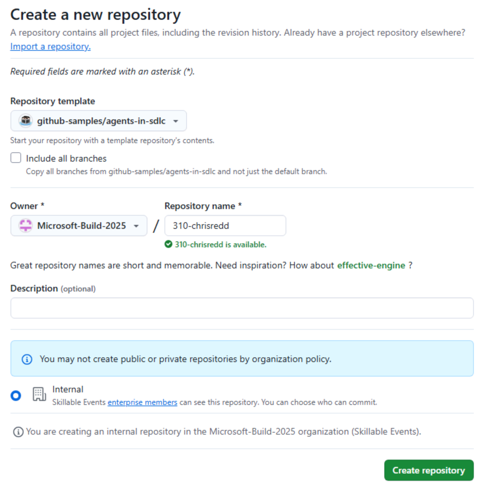
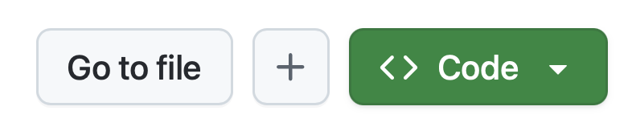
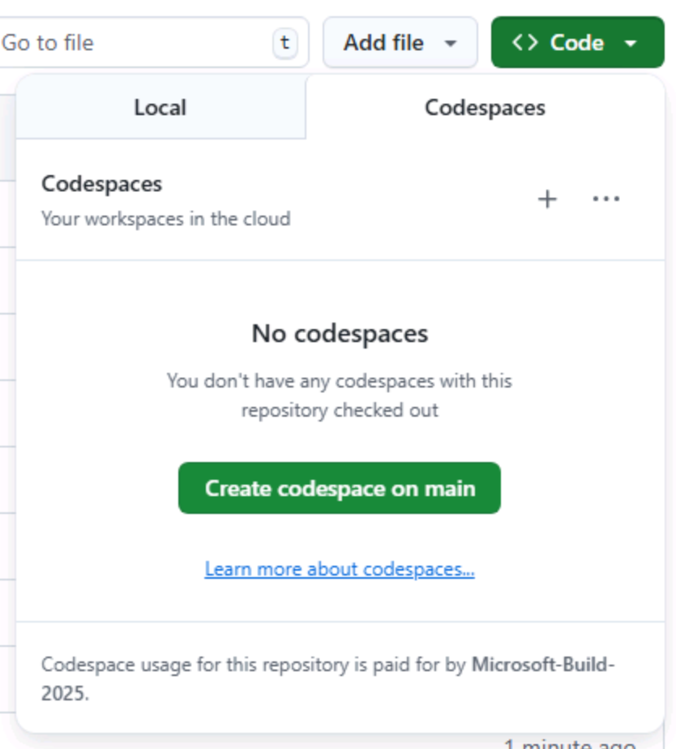

<!-- l10n-sync: source-file="00-prereqs.md" -->
# Exercício 0: Pré-requisitos

Antes de começar o laboratório, há algumas tarefas que você precisa completar para deixar tudo pronto. Primeiro, você deve criar sua própria cópia do repositório e, em seguida, escolher se deseja trabalhar em um [codespace][codespaces] ou clonando seu próprio repositório localmente.

## Configurando o Repositório do Laboratório

Para criar uma cópia do repositório para o código, você criará uma instância a partir do [template][template-repository]. A nova instância conterá todos os arquivos necessários para o laboratório, e você a usará enquanto trabalha nos exercícios.

1. Em uma nova janela do navegador, navegue até o repositório GitHub deste laboratório: `https://github.com/copilot-dev-days/tailspin-toys-workshop`.
2. Crie sua própria cópia do repositório selecionando o botão **Use this template** na página do repositório do laboratório. Em seguida, selecione **Create a new repository**.

    

3. Se você está completando o workshop como parte de um evento conduzido pelo GitHub ou Microsoft, siga as instruções fornecidas pelos mentores. Caso contrário, você pode criar o novo repositório em uma organização onde você tem acesso ao Copilot.

    

4. Anote o caminho do repositório que você criou (**nome-da-organização-ou-usuário/nome-do-repositório**), pois você precisará consultá-lo posteriormente no laboratório.

## Escolha Seu Ambiente de Desenvolvimento

Agora que você criou seu próprio repositório, escolha uma das seguintes opções:

### Opção A: Criar um Codespace para seu Repositório (recomendado)

[GitHub Codespaces][codespaces] é um ambiente de desenvolvimento baseado na nuvem que permite escrever, executar e depurar código diretamente no seu navegador. Ele oferece uma IDE completa com suporte a múltiplas linguagens de programação, extensões e ferramentas.

1. Navegue até o repositório recém-criado.
2. Selecione o botão verde **Code**.

    

3. Selecione a aba **Codespaces** e selecione o botão **+** para criar um novo Codespace.

    

A criação do codespace levará vários minutos, embora ainda seja muito mais rápido do que ter que instalar manualmente todos os serviços! Dito isso, você pode usar esse tempo para explorar outros recursos do GitHub Copilot, para os quais voltaremos sua atenção a seguir!

### Opção B: Clonar seu Repositório localmente

Se você prefere trabalhar localmente em vez de em um codespace, clone seu próprio repositório e abra-o no VS Code:

```bash
git clone https://github.com/<organization-or-user-name>/<repository-name>.git
cd <repository-name>
code .
```

> [!IMPORTANT]
> Se você escolheu a Opção A, você retornará ao codespace em um exercício futuro. Por enquanto, deixe-o aberto em uma aba do seu navegador.

> [!NOTE]
> Este workshop foi construído para rodar dentro de um codespace ou container. Isso garante que o ambiente em que você está trabalhando tenha todos os pré-requisitos necessários instalados e que você tenha uma experiência tranquila. Se você deseja rodar o workshop localmente no seu sistema, precisará de versões recentes do Node.js e Python instaladas, assim como o Visual Studio Code.

## Resumo

Parabéns, você criou uma cópia do repositório do laboratório e selecionou seu ambiente de desenvolvimento!

## Recursos

- [Visão geral do GitHub Codespaces][codespaces]
- [Criando um repositório a partir de um template][template-repository]
- [Primeiros passos com Codespaces][codespaces-quickstart]

---

[codespaces]: https://github.com/features/codespaces
[template-repository]: https://docs.github.com/repositories/creating-and-managing-repositories/creating-a-template-repository
[codespaces-quickstart]: https://docs.github.com/codespaces/getting-started/quickstart
